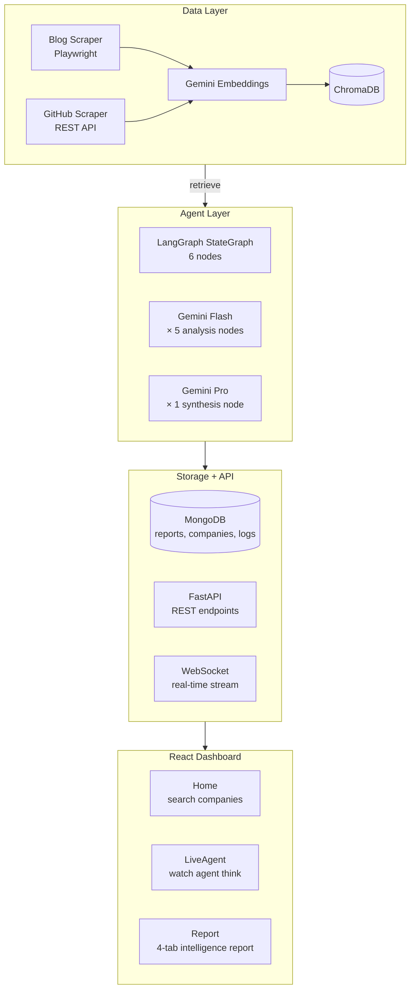
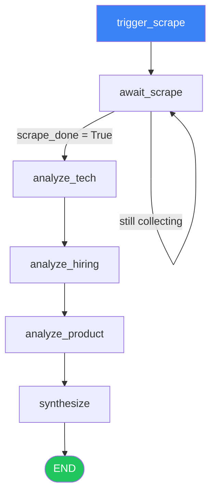

# 👁️ watchR.ai
### Autonomous Competitive Intelligence Agent for Indian Startups

## What You Get
 
You type a company name. In minutes you get:
 
- **Tech stack signals** — what they're quietly adopting or retiring
- **Hiring pattern analysis** — what product each role signals
- **Product launch predictions** — with confidence scores and timelines
- **AI/ML maturity score** — where they stand vs competitors
- **Executive intelligence brief** — written like a VC research note
**No human input after the company name. The autonomous agent does everything.**
 
 
## Build Progress
 
| Phase | Status |
|-------|--------|
| Docker Infrastructure | ✅ |
| Database Layer | ✅ |
| Blog + GitHub Scraper | ✅ |
| RAG Pipeline | ✅ |
| LangGraph Agent | ✅ |
| React Dashboard | ⏳ |
 
 
## Architecture
 

 
 
## Graph Flow
 

 
## Agent Pipeline — Node by Node
 
| Node | Input | What it does | Output |
|------|-------|-------------|--------|
| `trigger_scrape` | company name | Fires Celery task | task_id |
| `await_scrape` | task_id | Polls until scraping done | blog articles, GitHub data |
| `analyze_tech` | ChromaDB chunks | Finds tech stack signals | TechSignal[] with confidence |
| `analyze_hiring` | ChromaDB chunks | Decodes hiring → initiatives | HiringSignal[] |
| `analyze_product` | ChromaDB chunks | Predicts launches | ProductSignal[] with probability |
| `synthesize` | All signals | Writes executive brief | Executive summary |
 
---
 

*🚧 Actively developed.*
 

  